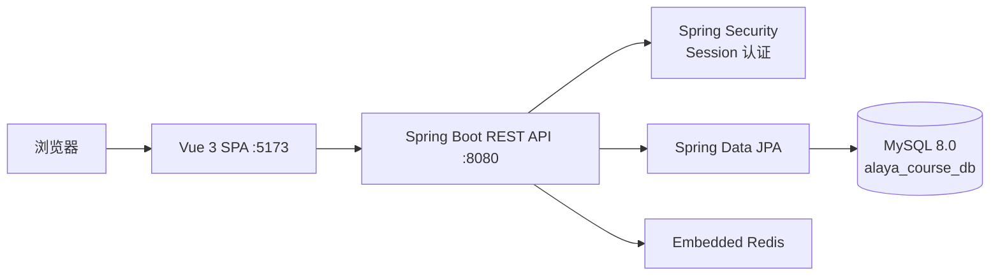

# Alaya 大学选课系统 — 后端

基于 Spring Boot 的大学选课系统后端服务，为学生、教师、管理员提供选课、课程管理、成绩管理与数据统计的 REST API。

---

## 技术栈

| 技术 | 版本/说明 |
|------|----------|
| Java | 17 |
| Spring Boot | 3.5.7 |
| MySQL | 8.0 |
| ORM | Spring Data JPA (Hibernate) |
| 认证 | Spring Security (Session-based) |
| 缓存 | Redis (Embedded) |
| 构建 | Maven |
| 端口 | 8080 |

---

## 功能模块

- **认证模块**：登录 / 注册 / 登出，Session 认证，BCrypt 密码加密
- **学生端**：浏览课程列表、选课 / 退课（容量控制）、查看已选课程、查看成绩（按学期筛选）
- **教师端**：课程 CRUD、查看选课学生名单（分页+搜索）、成绩单条/批量录入（自动计算等级）
- **管理员端**：用户 CRUD（分页+关键词+角色筛选）、重置密码、教师列表、课程统计（选课率/人数）、统计导出
- **公共接口**：课程详情查询、用户信息修改

---

## 系统架构



---

## 项目结构

```
src/main/java/com/alaya/coursesystem/alaya_course_selection/
├── controller/        # REST 控制器
│   ├── AuthController.java           # 登录/注册/登出
│   ├── StudentCourseController.java  # 学生选课 API
│   ├── TeacherController.java        # 教师课程与成绩 API
│   ├── AdminController.java          # 管理员用户与统计 API
│   ├── CourseController.java         # 公共课程 API
│   ├── GradeController.java          # 成绩查询 API
│   └── UserController.java           # 用户信息 API
├── service/           # 业务逻辑层
├── repository/        # JPA 数据访问层
├── entity/            # 实体类（User, Course, CourseSelection, Grade, Role 等）
├── config/            # 配置类（Security, CORS, Redis, 全局异常处理）
├── dto/               # 数据传输对象
├── vo/                # 视图对象（分页响应、统计 VO）
└── util/              # 工具类
```

---

## 环境要求

- JDK 17+
- MySQL 8.0+
- Maven 3.6+（项目自带 `mvnw`，无需全局安装）

---

## 快速启动

### 1. 创建数据库

```sql
CREATE DATABASE alaya_course_db DEFAULT CHARACTER SET utf8mb4;
```

### 2. 修改配置

编辑 `src/main/resources/application-dev.yml`：

```yaml
spring:
  datasource:
    url: jdbc:mysql://localhost:3306/alaya_course_db?useSSL=false&serverTimezone=Asia/Shanghai
    username: root
    password: 123456
```

### 3. 启动

```bash
./mvnw spring-boot:run
```

启动后访问 `http://localhost:8080/hello` 验证。

> **注意**：JPA 配置为 `ddl-auto: update`，首次启动会自动建表。`User` 实体含 `idCard` 唯一字段，若表已存在 JPA 会自动加列。

---

## 核心配置说明

| 配置项 | 位置 | 说明 |
|--------|------|------|
| 数据库连接 | `application-dev.yml` | MySQL 连接信息，默认 `localhost:3306/alaya_course_db` |
| JPA 自动建表 | `application-dev.yml` | `ddl-auto: update`，生产环境建议改为 `validate` |
| API 前缀 | Controller `@RequestMapping` | 所有 API 统一以 `/api` 开头 |
| Session 认证 | `SecurityConfig.java` | 基于 Session，最大并发数 1 |
| CORS 跨域 | `CorsConfig.java` | 允许前端 `http://localhost:5173` 跨域请求 |
| 密码加密 | `SecurityConfig.java` | BCryptPasswordEncoder(12) |

---

## API 概览

### 认证（公开）

| 方法 | 路径 | 说明 |
|------|------|------|
| POST | `/api/auth/login` | 登录 |
| POST | `/api/auth/register` | 注册 |
| POST | `/api/auth/logout` | 登出 |

### 学生端（需 STUDENT 角色）

| 方法 | 路径 | 说明 |
|------|------|------|
| GET | `/api/student/courses` | 课程列表（分页+关键词+学期筛选） |
| POST | `/api/student/courses/{id}/select` | 选课 |
| DELETE | `/api/student/courses/{id}/withdraw` | 退课 |
| GET | `/api/student/selections` | 已选课程 |
| GET | `/api/student/grades` | 成绩查询（支持学期筛选） |

### 教师端（需 TEACHER 角色）

| 方法 | 路径 | 说明 |
|------|------|------|
| GET | `/api/teacher/courses` | 我的课程列表 |
| GET | `/api/teacher/courses/{id}` | 课程详情 |
| POST | `/api/teacher/courses` | 创建课程 |
| PUT | `/api/teacher/courses/{id}` | 编辑课程 |
| DELETE | `/api/teacher/courses/{id}` | 删除课程 |
| GET | `/api/teacher/courses/students` | 选课学生列表（分页+搜索） |
| POST | `/api/teacher/grades` | 单条保存成绩 |
| POST | `/api/teacher/grades/batch` | 批量保存成绩 |

### 管理员端（需 ADMIN 角色）

| 方法 | 路径 | 说明 |
|------|------|------|
| GET | `/api/admin/users` | 用户列表（分页+关键词+角色筛选） |
| POST | `/api/admin/users` | 创建用户 |
| PUT | `/api/admin/users/{id}` | 编辑用户 |
| DELETE | `/api/admin/users/{id}` | 删除用户 |
| POST | `/api/admin/users/{id}/reset-pwd` | 重置密码 |
| GET | `/api/admin/teachers` | 教师列表 |
| GET | `/api/admin/courses/stats` | 课程统计 |
| GET | `/api/admin/courses/stats/export` | 导出统计 |

---

## 部署指南

### Jar 打包

```bash
./mvnw clean package -DskipTests
```

生成的 jar 位于 `target/alaya-course-selection-*.jar`。

### 生产运行

```bash
java -jar target/alaya-course-selection-*.jar --spring.profiles.active=prod
```

生产环境建议创建 `application-prod.yml`，将数据库密码等敏感信息通过环境变量注入：

```yaml
spring:
  datasource:
    password: ${DB_PASSWORD}
```

### systemd 服务（Linux）

```
[Unit]
Description=Alaya Course Selection Backend
After=network.target

[Service]
User=app
ExecStart=/usr/bin/java -jar /opt/alaya/alaya-course-selection.jar --spring.profiles.active=prod
Restart=on-failure

[Install]
WantedBy=multi-user.target
```

### Nginx 反向代理

```nginx
location /api/ {
    proxy_pass http://127.0.0.1:8080/api/;
    proxy_set_header Host $host;
    proxy_set_header X-Forwarded-For $proxy_add_x_forwarded_for;
}
```

---

## 开发约定

- **统一响应格式**：`{ code: 200, message: "...", data: ... }`，分页使用 `PageResponseVO<T>`：`{ total, pages, pageNum, pageSize, list }`
- **角色枚举**：`STUDENT` / `TEACHER` / `ADMIN`（大写），Jackson 序列化/反序列化使用 `name()`，前端必须传大写值
- **`@JsonProperty` 规则**：`CourseSelection.user` 映射为 JSON 的 `"student"`，前端统一用 `student.xxx` 访问。新增字段应让前端对齐后端字段名，避免使用 `@JsonProperty` 改名
- **`@Transient` 字段**：JPA 不持久化但 Jackson 默认序列化，用于临时计算字段（如 `alreadySelected`、`gradeStatus`）
- **修改后端代码后需重启服务**，Session 全部失效，浏览器需重新登录

---

## 常见问题

### 启动报错：数据库连接失败

检查 MySQL 是否运行、数据库 `alaya_course_db` 是否已创建、`application-dev.yml` 中用户名密码是否正确。

### API 返回 403 Forbidden

Session 过期或未登录。重启后端后所有 Session 失效，需在浏览器重新登录。如果新加端点返回 403，检查 `SecurityConfig` 的 URL 权限规则是否覆盖。

### 前端请求 404

检查前端 API 调用是否误加了 `/api` 前缀。前端 `request.js` 的 `baseURL` 已含 `/api`，重复会导致双重前缀 → 404。

### JPA 自动建表相关

`ddl-auto: update` 会自动加列但不会删列。若需重建表，改为 `create` 或 `create-drop` 后重启（注意数据会丢失）。

---

## 维护者

- **fengyuan404** — YouFull@163.com